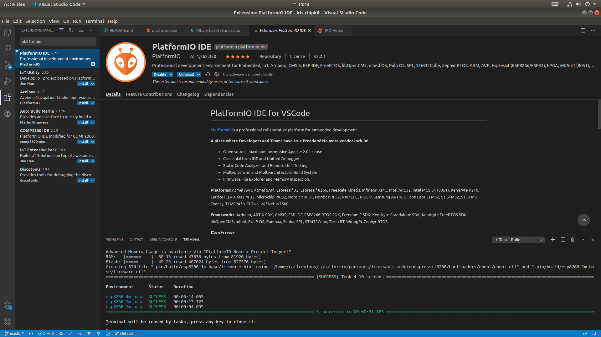
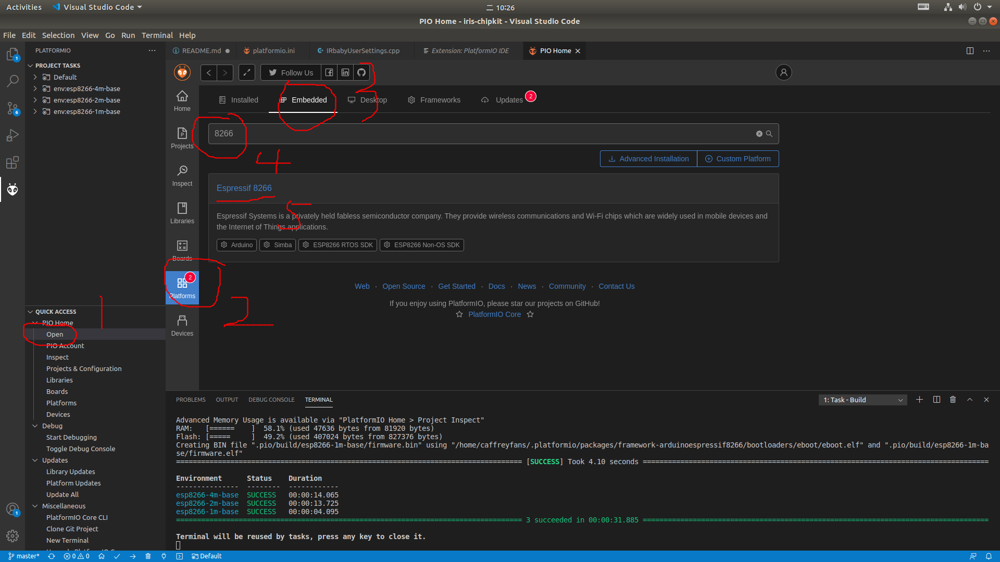
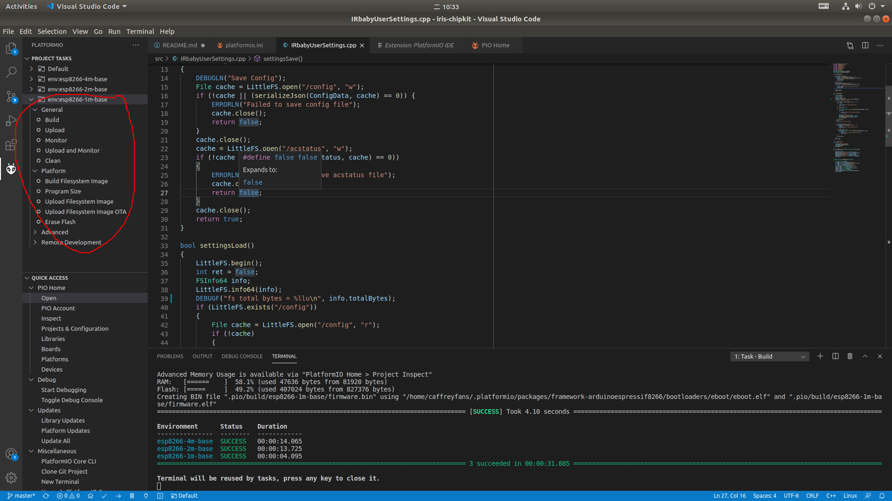

# IRbaby-Firmware

## 编译环境搭建
1. 使用 VScode 打开 `iris-chipkit` 文件夹。
2. 使用 VScode 下载安装 PlatformIO IDE 插件。
3. 安装 ESP8266 SDK。
4. 编译上传固件。

## 说明
1. 固件应区分 flash 大小。ESP01 模组为 1m flash 所以只能烧录 1m 的固件。
2. 固件的上位机为 [IRbaby-android](https://github.com/Caffreyfans/IRbaby-android/releases/download/0.9/IRbaby.apk)。